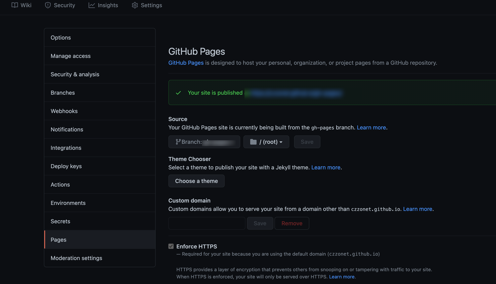

# 博客系统

使用 webpack 打包 md，github 托管

## 基础原理

### md

md 可以统一由 webpack 打包，可以只上传写好的 md

### GitHub

仓库的 settings=>pages，然后 dronci 进行自动部署。

## 问题

### 抄袭？

容易被复制

### 目的

展示自己的技术栈，日常知识记录。历程。

## 实现

md 打包 loader：
